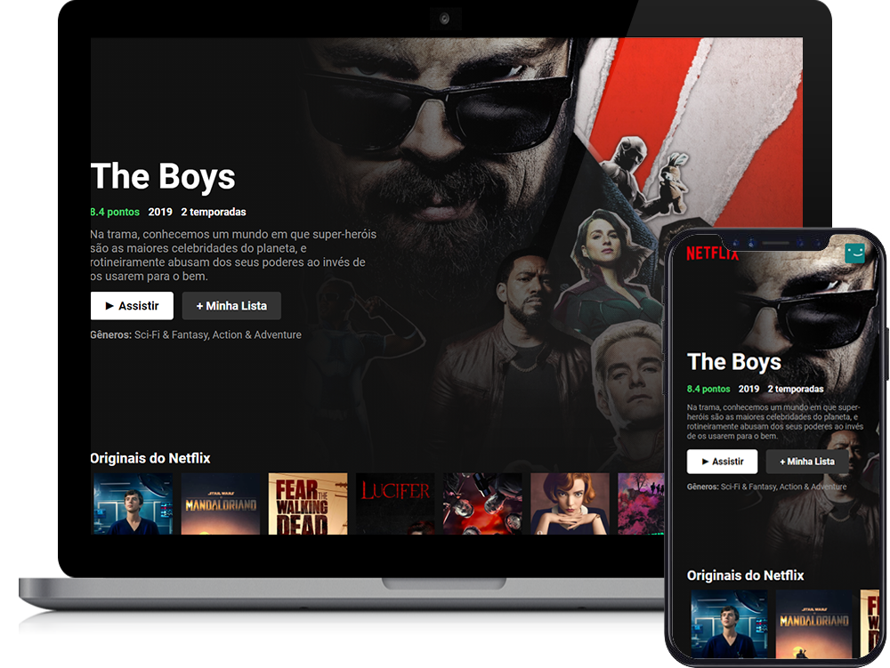

# Netflix Clone UI

  <a href="#-tecnologias">Tecnologias</a>&nbsp;&nbsp;&nbsp;|&nbsp;&nbsp;&nbsp;
  <a href="#-projeto">Projeto</a>&nbsp;&nbsp;&nbsp;|&nbsp;&nbsp;&nbsp;
  <a href="#-demonstração">Demonstração</a>&nbsp;&nbsp;&nbsp;|&nbsp;&nbsp;&nbsp;
  <a href="#-licença">Licença</a>

 

  

## 🚀 Tecnologias

Esse projeto foi desenvolvido utilizando as seguintes tecnologias:

- [Node.js](https://nodejs.org/en/)
- [React](https://pt-br.reactjs.org/)
- [React-Swipeable](https://www.npmjs.com/package/react-swipeable)
- [Material UI (icons)](https://material-ui.com/pt/)

## 💻 Projeto

Este projeto visa chegar o mais proximo do catálogo de filmes/séries da Netflix.

Desenvolvido [durante uma live no Youtube](https://www.youtube.com/watch?v=tBweoUiMsDg) feita pelo [Bonieky Lacerda](https://b7web.com.br/)

## 📲 Demonstração

Você também pode visualizar este projeto via [Heroku](https://www.heroku.com/):
- [Netflix Clone UI](https://netflix-clone-foolish-build.herokuapp.com/)
Há uma possibilidade do servidor estar inativo.

## 📝 Licença

Esse projeto está sob a licença [MIT](LICENSE).

---

Desenvolvido com 💜 por Wagner Rodrigues

